[Home](../../) | [Contact](../../contact.md)

# 6D Pose Estimation from Monocular RGB

Estimate the 6D pose (position and orientation) of a mug with known geometry from monocular RGB images.

# Contents

- [1. Overview](#1-overview)
- [2. Environment](#2-environment)
- [3. Training Data Generation](#3-training-data-generation)
- [4. Object Detection Model](#4-object-detection-model)
- [5. Keypoint Model](#5-keypoint-model)
- [6. Pose Estimation](#6-pose-estimation)
- [7. Performance Comparison with Raspberry Pi](#7-performance-comparison-with-raspberry-pi)
- [8. Annotation Improvement](#8-annotation-improvement)

# 1. Overview

This project estimates the 6D pose (position and orientation) of a mug with known geometry from monocular RGB images.

First, 3,000 synthetic images and their Ground Truth are generated in Blender by randomly varying the camera and mug positions and orientations. This Sim data is used to train an object detection model that detects the mug in an image.

Next, the image is cropped based on the BBox obtained from the object detection model, and a keypoint model is trained to detect predefined keypoints on the 3D model of the mug.

The following pipeline is used for inference on real images.

**RGB Image → Object Detection → BBox Crop → Keypoint Detection → PnP → 6D Pose**

PnP estimates the position and orientation of the mug in the camera coordinate system from the detected 2D keypoints and the corresponding known 3D keypoint coordinates.

The keypoint model trained only on Sim data is then fine-tuned using 173 manually annotated real images. Finally, two models are evaluated on the same pipeline using 961 real images:

- **Sim Only**: Keypoint model trained only on Sim data
- **Real Fine-tuning**: Sim model fine-tuned on real data

Keypoint confidence, the number of PnP inliers, reprojection error, and the number of `solvePnPRansac` failures are compared.

The geometric consistency of the real-image keypoint annotations is also improved, and its effect on the stability of PnP pose estimation is examined.

Because 6D Pose Ground Truth is not available for the real images, this document does not evaluate the absolute accuracy of the estimated poses. Instead, the comparison uses keypoint confidence, the number of PnP inliers, reprojection error, the number of RANSAC failures, and pose-estimation stability across frames.

# 2. Environment

```
tool-detection-pose/
├── blender
├── cam_calib
├── detection
├── docs
├── keypoint
├── README.md
└── real_dataset
```

```bash
$ cd keypoint/
$ source .venv/bin/activate
(.venv) $ python --version
Python 3.11.2
```

# 3. Training Data Generation

Training data is generated by moving the camera and randomly varying the position and orientation of the mug.

```
├── blender
│   ├── 0550.txt
│   ├── 0551.txt
│   ├── 0552.txt
│   ├── datagen_random_camera_mug.py
│   ├── synthetic_dataset_0550_randomcam
│   ├── synthetic_dataset_0551_randomcam
│   ├── synthetic_dataset_0552_randomcam
│   └── tool_pose.blend
```

```
blender -b tool_pose.blend -P datagen_random_camera_mug.py -- 0550.txt
```

`0550.txt`, `0551.txt`, and `0552.txt` define the camera and mug positions and orientations.
```
IMG_0550

#1 
Camera
  location = (1.10000002, -0.18405022, 1.08624732)
  rotation_deg = (75.080479, 1.535211, 92.172959)

Mug_Root
  location = (0.43371654, -0.24633931, 0.78921199)
  rotation_deg = (90.049760, -331.921048, -66.042895)
...  
```

Total training data: `3,000` images:
```
synthetic_dataset_0550_randomcam
├── gt
│   ├── s0550_0000.json
...
│   └── s0550_0999.json
└── images
    ├── s0550_0000.png
...
    └── s0550_0999.png
```
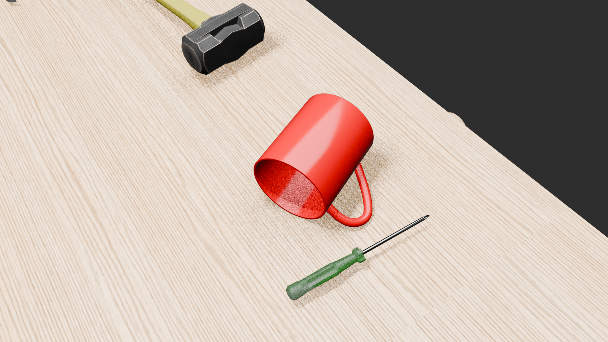

```
synthetic_dataset_0551_randomcam
├── gt
│   ├── s0551_0000.json
...
│   └── s0551_0999.json
└── images
    ├── s0551_0000.png
...
    └── s0551_0999.png
```
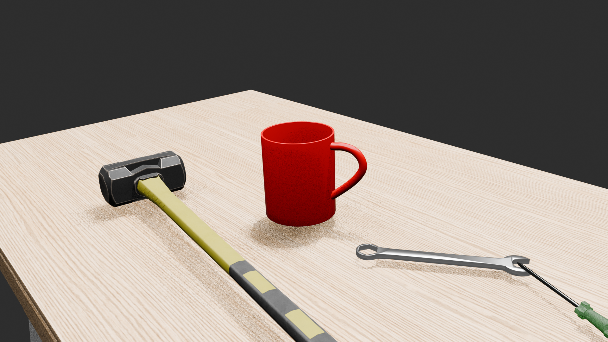

```
synthetic_dataset_0552_randomcam
├── gt
│   ├── s0552_0000.json
...
│   └── s0552_0999.json
└── images
    ├── s0552_0000.png
...
    └── s0552_0999.png
```
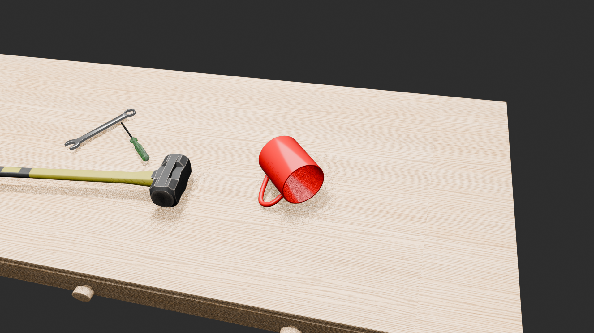


# 4. Object Detection Model

## 4.1 Model

PyTorch / TorchVision `ssdlite320_mobilenet_v3_large` is used for object detection.

- Source image resolution: 1920 × 1080
- Detector: SSDLite320 MobileNetV3-Large
- Detector internal input size: 320 × 320
- Classes: Background / Combination Wrench / Mug
- Output: Class, confidence score, BBox

This model is used to detect and crop the mug region for the subsequent keypoint detection stage.

`train.py` and `dataset.py` are used, with model weights saved to `models/`.

```bash
(.venv) detection$ python train.py 
Device: cuda
Train samples: 3000
Epoch 001/100 train_loss=3.324669
Epoch 002/100 train_loss=1.868230
Epoch 003/100 train_loss=1.370852
Epoch 004/100 train_loss=1.174247
Epoch 005/100 train_loss=1.005588
  saved: models/ssdlite320_sim0550_0552_epoch_005.pth
Epoch 006/100 train_loss=0.940396
...
```

The model is trained for 50 epochs, with weights saved every 5 epochs:
```bash
(.venv) rinda@P1G7 detection$ ls models/
ssdlite320_sim0550_0552_epoch_005.pth  ssdlite320_sim0550_0552_epoch_020.pth  ssdlite320_sim0550_0552_epoch_035.pth  ssdlite320_sim0550_0552_epoch_050.pth
ssdlite320_sim0550_0552_epoch_010.pth  ssdlite320_sim0550_0552_epoch_025.pth  ssdlite320_sim0550_0552_epoch_040.pth
ssdlite320_sim0550_0552_epoch_015.pth  ssdlite320_sim0550_0552_epoch_030.pth  ssdlite320_sim0550_0552_epoch_045.pth
```

Inference on the real data is performed with each saved weight file:
```bash
(.venv) detection$ python infer_real_multi_pth.py 
```

Inference results:
```bash
results_real_randomcam_multi_pth
├── all_epochs_scene_summary.csv
├── epoch_010
│   ├── frame_results.csv
│   ├── scene_summary.csv
│   └── vis
├── epoch_020
│   ├── frame_results.csv
│   ├── scene_summary.csv
│   └── vis
├── epoch_030
│   ├── frame_results.csv
│   ├── scene_summary.csv
│   └── vis
├── epoch_040
│   ├── frame_results.csv
│   ├── scene_summary.csv
│   └── vis
└── epoch_050
    ├── frame_results.csv
    ├── scene_summary.csv
    └── vis
```

The `epoch_030` weights are selected as the detection model. The following results are from `epoch_030/scene_summary.csv`:

| Object | Frames | Success | Low Confidence | Total Detected | Detection Rate | Miss |
|---|---:|---:|---:|---:|---:|---:|
| Mug | 961 | **961** | 0 | **961** | **100.0%** | 0 |
| Combination Wrench | 961 | 449 | 208 | **657** | **68.4%** | 304 |

`Mug` detection is `100%`, indicating that the mug in the real dataset can be detected by the simulation-trained model.

The detection rate for `Combination Wrench` is lower. A likely reason is the large appearance gap between the simulated Combination Wrench and the real object.

**From this point onward, only the Mug, which is the target of 6D Pose estimation, is considered; the Combination Wrench is not discussed further.**

[Synthetic-to-Real Object Detection | Blender + PyTorch on YouTube](https://youtube.com/shorts/THVDTcLsF0w)


# 5. Keypoint Model

## 5.1 Model

A Heatmap Regression-based model is used for keypoint detection.

- Input: 420 × 420 cropped RGB image
- Keypoints: 11 points
- Output: 11 keypoint heatmaps
- Heatmap size: 112 × 112
- Keypoint position: Heatmap peak position
- Training: Synthetic data → Real fine-tuning

Each keypoint corresponds to a point on the known 3D model of the mug. The detected 2D coordinates and the known 3D coordinates are used for PnP.

```
keypoint/
├── dataset
├── model
├── output
├── training
```

`dataset` directory:

```
dataset/
├── real
│   ├── detection
│   ├── gt
│   ├── gt_visuals
│   ├── images
│   └── metadata.csv
├── real_anno
│   ├── IMG_0538_00008.jpg
│   ├── IMG_0538_00008.json
...
│   ├── IMG_0552_00088.jpg
│   └── IMG_0552_00088.json
└── sim
    ├── detection
    ├── gt
    ├── gt_visuals
    ├── images
    └── metadata.csv
```

`real_anno`: Manually annotated real data.
`sim`: Sim data generated by `datagen_keypoint_sim.py`.
`real`: Real data used to fine-tune the Sim model, generated by `datagen_keypoint_real.py`.


## 5.2 Sim Model

### 5.2.1 Training Data Generation

`datagen_keypoint_sim.py` 

```python
SOURCE_DIRS = [
    Path("../blender/synthetic_dataset_0550_randomcam"),
    Path("../blender/synthetic_dataset_0551_randomcam"),
    Path("../blender/synthetic_dataset_0552_randomcam"),
]

MODEL_PATH = Path(
    "../detection/models/"
    "ssdlite320_sim0550_0552_epoch_030.pth"
)

CROP_SIZE = 420
OUTPUT_SIZE = 420
```

The Sim data in `SOURCE_DIRS` is processed with the detection model specified by `MODEL_PATH`. Images are cropped from the detected BBox and output at `420x420`, with sufficient margin around the BBox.

Output:
```
dataset/sim
├── detection
├── gt
├── gt_visuals
├── images
└── metadata.csv
```

### 5.2.2 Model Training
The model is trained using `train.py`, `model.py`, and `dataset.py`:

```bash
(.venv) keypoint$ python training/train.py 
Device: cuda
Train samples: 2971
Epoch 001 | train loss=0.003636 mean=147.95px max=497.90px
  [BEST] epoch=1 train_mean=147.95px
Epoch 002 | train loss=0.000607
Epoch 003 | train loss=0.000579
Epoch 004 | train loss=0.000573
Epoch 005 | train loss=0.000569
Epoch 006 | train loss=0.000567
Epoch 007 | train loss=0.000567
Epoch 008 | train loss=0.000565
Epoch 009 | train loss=0.000562
Epoch 010 | train loss=0.000558 mean=129.44px max=429.86px
  [BEST] epoch=10 train_mean=129.44px
Epoch 011 | train loss=0.000550
...
Epoch 200 | train loss=0.000007 mean=  1.57px max=104.14px

============================================================
TRAINING COMPLETE
============================================================
Best epoch       : 190
Best train error : 1.56px
Best train mean  : 1.56px

Train per-keypoint error:
  K0: mean=  1.56px max=  3.89px
  K1: mean=  1.57px max=  4.30px
  K2: mean=  1.56px max=  4.53px
  K3: mean=  1.57px max=  4.70px
  T0: mean=  1.53px max=  4.03px
  T1: mean=  1.59px max=  4.23px
  T2: mean=  1.57px max=  4.27px
  T3: mean=  1.61px max= 71.67px
  K4: mean=  1.52px max=  4.06px
  K5: mean=  1.56px max=  4.45px
  K6: mean=  1.53px max= 39.06px

Best model : model/sim/best_model.pth
History    : model/sim/training_history.csv
Visuals    : model/sim/train_visuals

```
### 5.2.3 Large-error samples

The mean keypoint error of the best model (epoch 190) on the training data was 1.56 px.

- T3: max 71.67 px
- K6: max 39.06 px
- Other keypoint errors: max 5.01 px

Inspection of the corresponding images showed that the T3 and K6 keypoint locations were occluded by another object.

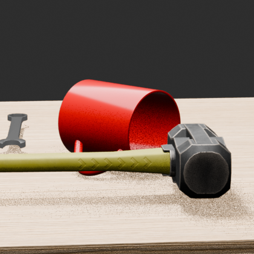
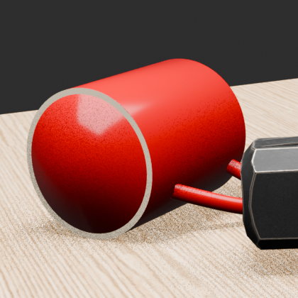

Therefore, the large errors occurred when estimating keypoints that could not be directly observed because of occlusion, rather than from failures to detect normally visible keypoints.

### 5.2.4 Best Model

The model is trained for 200 epochs, with weights saved every 10 epochs:

```bash
(.venv) keypoint$ ls model/sim
best_model.pth  epoch_020.pth  epoch_050.pth  epoch_080.pth  epoch_110.pth  epoch_140.pth  epoch_170.pth  epoch_200.pth
epoch_001.pth   epoch_030.pth  epoch_060.pth  epoch_090.pth  epoch_120.pth  epoch_150.pth  epoch_180.pth  training_history.csv
epoch_010.pth   epoch_040.pth  epoch_070.pth  epoch_100.pth  epoch_130.pth  epoch_160.pth  epoch_190.pth  train_visuals
```

`best_model.pth` stores the model weights from the checkpoint with the lowest train mean error during training. In this run, the weights from epoch 190 were selected.


## 5.3 Real Model

### 5.3.1 Real-Image Annotation

Keypoint annotations are defined as GT for **173** of the **961** real images.
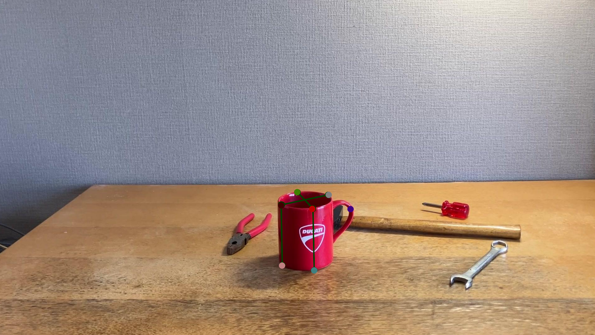

### 5.3.2 Training Data Generation

`datagen_keypoint_real.py` 

```python
DEFAULT_SOURCE_DIR = Path("dataset/real_anno")
DEFAULT_OUTPUT_DIR = Path("dataset/real")

DEFAULT_MODEL_PATH = Path(
    "../detection/models/"
    "ssdlite320_sim0550_0552_epoch_030.pth"
)

NUM_CLASSES = 3
MUG_LABEL = 2
SCORE_THRESHOLD = 0.5

CROP_SIZE = 420
OUTPUT_SIZE = 420

KEYPOINT_NAMES = [
    "K0",
    "K1",
    "K2",
    "K3",
    "T0",
    "T1",
    "T2",
    "T3",
    "K4",
    "K5",
    "K6",
]
```

Training data for fine-tuning is generated in `DEFAULT_OUTPUT_DIR` from the annotated real data in `DEFAULT_SOURCE_DIR`. The object detection model specified by `DEFAULT_MODEL_PATH` is used to generate `420x420` images, and GT including `KEYPOINT_NAMES` is created from `DEFAULT_SOURCE_DIR`.

Output:
```
dataset/real
├── detection
├── gt
├── gt_visuals
├── images
└── metadata.csv
```

### 5.3.3 Model Training

The model is trained using `train_real_fit.py`, `model.py`, and `dataset_real.py`.

`dataset_real.py`

```python
DATASET_ROOT = (
    "dataset/real"
)

BASE_MODEL = Path(
    "model/sim/best_model.pth"
)

OUTPUT_DIR = Path(
    "model/real"
)

EPOCHS = 300
```
Training data: `DATASET_ROOT`; base model for fine-tuning: `BASE_MODEL`; output directory: `OUTPUT_DIR`; epochs: `300`.


```bash
(.venv)  keypoint$ python training/train_real_fit.py 
Device: cuda
Train samples: 173
Skipped: {'missing_image': 0, 'no_keypoint': 0, 'invalid_gt': 0}
Base model: model/sim/best_model.pth
Base epoch: 190
Base synthetic train mean: 1.56px

Before fine-tuning | mean=126.23px max=425.33px valid=1414

Before fine-tuning per-keypoint error:
  K0: n=109 mean=156.66px max=299.01px
  K1: n=108 mean=185.39px max=404.57px
  K2: n=125 mean=136.62px max=348.14px
  K3: n= 91 mean=155.22px max=276.81px
  T0: n=145 mean= 85.96px max=359.21px
  T1: n=128 mean=116.61px max=411.70px
  T2: n=135 mean=161.65px max=390.46px
  T3: n=166 mean=145.10px max=385.73px
  K4: n=118 mean=108.26px max=344.40px
  K5: n=116 mean= 81.79px max=286.29px
  K6: n=173 mean= 84.57px max=425.33px

Epoch 001 | train loss=0.000556 mean=116.90px max=422.06px valid=1414
  [BEST] epoch=1 train_mean=116.90px
Epoch 002 | train loss=0.000529
Epoch 003 | train loss=0.000506
Epoch 004 | train loss=0.000481
Epoch 005 | train loss=0.000453
Epoch 006 | train loss=0.000420
Epoch 007 | train loss=0.000386
Epoch 008 | train loss=0.000353
Epoch 009 | train loss=0.000325
Epoch 010 | train loss=0.000300 mean= 33.57px max=420.29px valid=1414
  [BEST] epoch=10 train_mean=33.57px
Epoch 011 | train loss=0.000278

...

Epoch 299 | train loss=0.000003
Epoch 300 | train loss=0.000003 mean=  1.47px max=  3.00px valid=1414
  [BEST] epoch=300 train_mean=1.47px

============================================================
REAL FINE-TUNING COMPLETE
============================================================
Best epoch       : 300
Best train error : 1.47px
Best train mean  : 1.47px
Best train max   : 3.00px

Best real-fit per-keypoint error:
  K0: n=109 mean=  1.42px max=  2.81px
  K1: n=108 mean=  1.48px max=  2.54px
  K2: n=125 mean=  1.45px max=  2.82px
  K3: n= 91 mean=  1.41px max=  2.60px
  T0: n=145 mean=  1.54px max=  2.65px
  T1: n=128 mean=  1.44px max=  3.00px
  T2: n=135 mean=  1.43px max=  2.58px
  T3: n=166 mean=  1.49px max=  2.73px
  K4: n=118 mean=  1.55px max=  2.85px
  K5: n=116 mean=  1.54px max=  2.56px
  K6: n=173 mean=  1.45px max=  2.85px

Best model : model/real/best_model.pth
History    : model/real/training_history.csv
Visuals    : model/real/train_visuals
(.venv) rinda@P1G7 keypoint$ df -k
Filesystem     1K-blocks      Used Available Use% Mounted on
tmpfs            3234836      3136   3231700   1% /run
/dev/nvme0n1p2 490048472 368155536  96926332  80% /
tmpfs           16174168     71580  16102588   1% /dev/shm
tmpfs               5120         8      5112   1% /run/lock
efivarfs             172        80        88  48% /sys/firmware/efi/efivars
/dev/nvme0n1p1   1098632      6288   1092344   1% /boot/efi
tmpfs            3234832       148   3234684   1% /run/user/1000
```

At epoch 300, the mean keypoint error on the training data was `1.47` px.

# 6. Pose Estimation

`run_pipeline_real.py`
```python
DEFAULT_FRAMES_ROOT = Path(
    "../real_dataset/frames"
)

DEFAULT_DETECTOR_PATH = Path(
    "../detection/models/ssdlite320_sim0550_0552_epoch_030.pth"
)

DEFAULT_KEYPOINT_MODEL_PATH = Path(
    "model/sim/best_model.pth"
    # "model/real/best_model.pth"
)

DEFAULT_OUTPUT_DIR = Path(
    "output/pipeline_keypoint_real_simonly"
    # "output/pipeline_keypoint_real"
)

RANSAC_REPROJ_ERROR = 12.0 #8.0 #5.0
FINAL_INLIER_ERROR = 12.0 #8.0 #5.0
```
`DEFAULT_DETECTOR_PATH`: Detection model; the Sim model is used.
`DEFAULT_KEYPOINT_MODEL_PATH`: Keypoint detection model.
`DEFAULT_OUTPUT_DIR`: Pose estimation output.

Validation using the real-image annotations showed annotation errors of several pixels. After testing multiple thresholds, `12.0` px was used for this evaluation.

For PnP, the 11 keypoints defined on the 3D model are matched with the 2D points estimated by the keypoint model. The following coordinates are used for the 3D keypoints. Units are meters.
```
| Point | X | Y | Z |
|---|---:|---:|---:|
| K0 | 0.036510 | -0.000531 | 0.001519 |
| K1 | -0.036406 | -0.000531 | 0.001519 |
| K2 | -0.000755 | -0.035998 | 0.001519 |
| K3 | -0.000755 | 0.036682 | 0.001519 |
| T0 | 0.036510 | -0.000531 | 0.088068 |
| T1 | -0.036406 | -0.000531 | 0.088068 |
| T2 | -0.000755 | -0.035998 | 0.088068 |
| T3 | -0.000755 | 0.036682 | 0.088068 |
| K4 | 0.037754 | -0.000025 | 0.078986 |
| K5 | 0.037754 | -0.000025 | 0.024736 |
| K6 | 0.071656 | 0.000064 | 0.061815 |
```

## 6.1 Sim Model

`model/sim/best_model.pth` is used.

```bash
(.venv) rinda@P1G7 keypoint$ python training/run_pipeline_real.py 
Device         : cuda
Frames root    : ../real_dataset/frames
Detector       : ../detection/models/ssdlite320_sim0550_0552_epoch_030.pth
Keypoint model : model/sim/best_model.pth
Canonical crop : 420x420
KP input       : 420x420
KP heatmap     : 112x112
KP checkpoint  : epoch=190
Processed: 1/961

...

Processed: 950/961

============================================================
UNIFIED REAL PIPELINE COMPLETE
============================================================
Images       : 961
Processed    : 961
No detection : 0
Output       : output/pipeline_keypoint_real_simonly
CSV log      : output/pipeline_keypoint_real_simonly/pipeline_log.csv
```

```
pipeline_keypoint_real_simonly
├── IMG_0538
│   ├── IMG_0538_00001_crop.png
│   ├── IMG_0538_00001_detection.png
│   ├── IMG_0538_00001_keypoints_crop.png
│   ├── IMG_0538_00001_keypoints_original.png
│   ├── IMG_0538_00001_pnp.png
│   ├── IMG_0538_00002_crop.png
│   ├── IMG_0538_00002_detection.png
│   ├── IMG_0538_00002_keypoints_crop.png
│   ├── IMG_0538_00002_keypoints_original.png
│   ├── IMG_0538_00002_pnp.png
...
├── IMG_0539
├── IMG_0540
├── IMG_0541
├── IMG_0542
├── IMG_0543
├── IMG_0544
├── IMG_0546
├── IMG_0547
├── IMG_0548
├── IMG_0549
├── IMG_0550
├── IMG_0551
├── IMG_0552
└── pipeline_log.csv
```

## 6.2 Real Model (Fine-tuned Model)

The Real model `model/real/best_model.pth` is used.


```bash
(.venv) keypoint$ python training/run_pipeline_real.py 
Device         : cuda
Frames root    : ../real_dataset/frames
Detector       : ../detection/models/ssdlite320_sim0550_0552_epoch_030.pth
Keypoint model : model/real/best_model.pth
Canonical crop : 420x420
KP input       : 420x420
KP heatmap     : 112x112
KP checkpoint  : epoch=300
Processed: 1/961
Processed: 50/961

...

Processed: 900/961
Processed: 950/961

============================================================
UNIFIED REAL PIPELINE COMPLETE
============================================================
Images       : 961
Processed    : 961
No detection : 0
Output       : output/pipeline_keypoint_real
CSV log      : output/pipeline_keypoint_real/pipeline_log.csv
```

```
pipeline_keypoint_real
├── IMG_0538
│   ├── IMG_0538_00001_crop.png
│   ├── IMG_0538_00001_detection.png
│   ├── IMG_0538_00001_keypoints_crop.png
│   ├── IMG_0538_00001_keypoints_original.png
│   ├── IMG_0538_00001_pnp.png
│   ├── IMG_0538_00002_crop.png
│   ├── IMG_0538_00002_detection.png
│   ├── IMG_0538_00002_keypoints_crop.png
│   ├── IMG_0538_00002_keypoints_original.png
│   ├── IMG_0538_00002_pnp.png
...
├── IMG_0539
├── IMG_0540
├── IMG_0541
├── IMG_0542
├── IMG_0543
├── IMG_0544
├── IMG_0546
├── IMG_0547
├── IMG_0548
├── IMG_0549
├── IMG_0550
├── IMG_0551
├── IMG_0552
└── pipeline_log.csv
```

`IMG_0538_00001_detection.png`
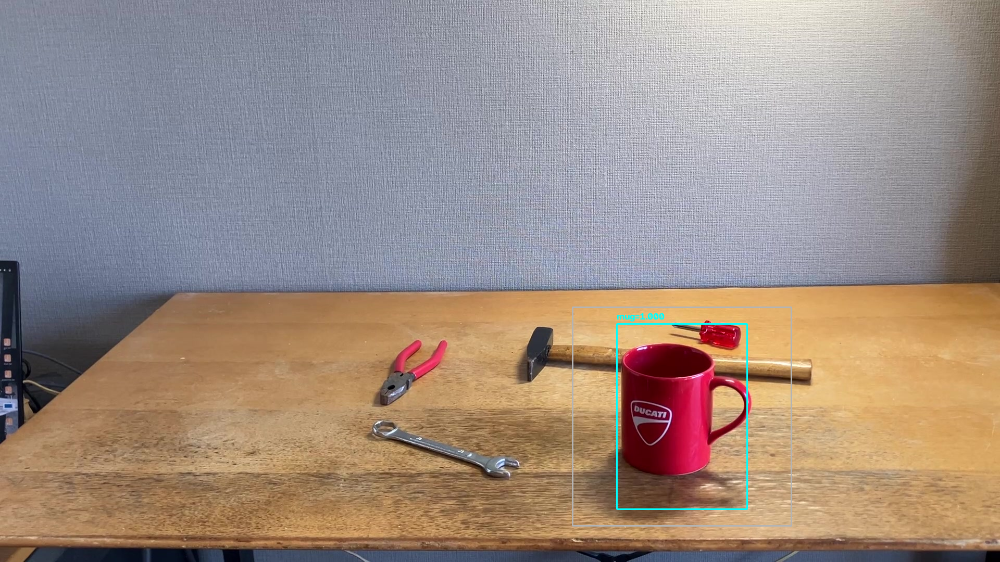
`IMG_0538_00001_crop.png`

`IMG_0538_00001_keypoints_crop.png`
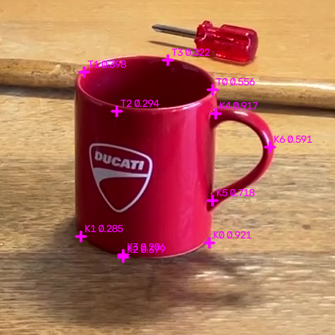
`IMG_0538_00001_keypoints_original.png`
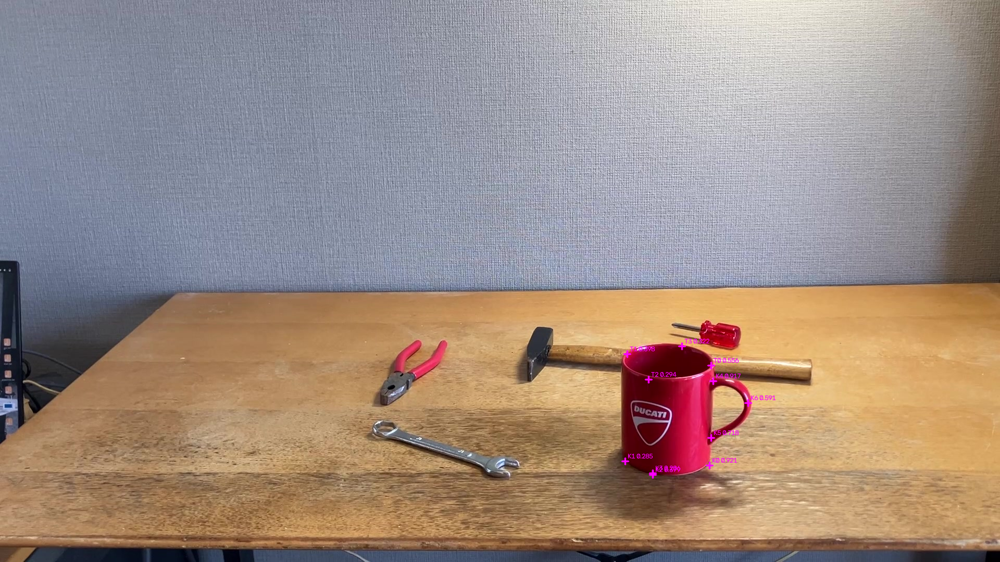
`IMG_0538_00001_pnp.png`


## 6.3 Sim / Real Model Comparison

The results of keypoint detection and PnP are compared for 961 real images using the Sim model and the Real fine-tuning model.

| Metric | Real Fine-tuning | Sim Only |
|---|---:|---:|
| Frames | 961 | 961 |
| Mean Keypoint Confidence | **0.604** | 0.104 |
| Mean PnP Final Inliers | **7.10** | 2.22 |
| Mean PnP All RMSE | **59.3 px** | 134.3 px |
| solvePnPRansac Failed | **21** | 538 |

Compared with the Sim Only model, the Real fine-tuning model produced higher keypoint confidence and a larger number of PnP final inliers. In particular, `solvePnPRansac` failures decreased from 538 with Sim Only to 21 with Real Fine-tuning.

These results indicate that Real Fine-tuning improved the confidence and geometric consistency of keypoint estimation on real images, resulting in substantially more stable PnP estimation. However, because 6D Pose Ground Truth is not available for the real images, this evaluation concerns the stability of the estimation process rather than the absolute accuracy of the estimated poses.

[6D Pose Estimation – Before Real-World Fine-Tuning (Sim Only) on YouTube](https://youtu.be/XR3__jy2JHs)
[6D Pose Estimation – After Real-World Fine-Tuning on YouTube](https://youtu.be/3KiCMTUQuoI)


# 7. Performance Comparison with Raspberry Pi

The same inference pipeline was run in the Ubuntu + CUDA environment used for training and evaluation and on a Raspberry Pi, and the inference results and processing speed were compared.

## 7.1 Raspberry Pi

### 7.1.1 Environment

| Item | Details |
|---|---|
| Device | Raspberry Pi 5 Model B Rev 1.0 |
| CPU | ARM Cortex-A76, 4 cores, max 2.4 GHz |
| Memory | 4 GB |
| OS | Debian GNU/Linux 12 (bookworm) |
| ONNX Runtime | 1.29.0 |
| Execution Provider | CPUExecutionProvider |

The trained object detection and keypoint estimation models were converted to ONNX format, and the inference pipeline was run on the Raspberry Pi.

The models used are shown below.

| Model | ONNX Model |
|---|---|
| Object Detection | `ssdlite320_sim0550_0552_epoch_030.onnx` |
| Keypoint Estimation | `best_model.onnx` |

The inference pipeline uses the following sequence:

**Object Detection → Crop → Keypoint Estimation → PnP Pose Estimation**

## 7.2 Ubuntu + CUDA

### 7.2.1 Environment

| Item | Details |
|---|---|
| CPU | Intel Core Ultra 7 155H, 16 cores / 22 threads, max 4.8 GHz |
| GPU | NVIDIA RTX 2000 Ada Generation, 8 GB |
| Memory | 30 GB |
| OS | Ubuntu 24.04.4 LTS |
| NVIDIA Driver | 580.126.09 |
| CUDA | 13.0 |
| Inference | PyTorch / CUDA |


The same input images as on the Raspberry Pi were used, with the same pipeline structure.


## 7.3 Performance Comparison

Using the same 961 real images, the inference results and processing speed were compared between the Raspberry Pi 5 and the Ubuntu + CUDA environment.

| Platform | Detection | Keypoint | PnP | Total | FPS |
|---|---:|---:|---:|---:|---:|
| Raspberry Pi 5 / CPU | 70.36 ms | 56.06 ms | 5.34 ms | 132.12 ms | 7.60 |
| Ubuntu / RTX 2000 Ada / CUDA | 60.25 ms | 21.87 ms | 5.18 ms | 87.71 ms | 11.60 |

The Ubuntu + CUDA environment processed the overall pipeline about 1.5 times faster than the Raspberry Pi 5. Keypoint estimation in particular decreased from 56.06 ms to 21.87 ms, making it about 2.6 times faster.

The inference results, however, were nearly identical between the two environments. Object detection scores matched for all 961 images, and the maximum difference in BBox coordinates was less than 0.001 px. The coordinates of all 11 keypoints also matched for all 961 images.

The PnP results were also nearly identical overall, although RANSAC nondeterminism caused a difference in which frames resulted in `RANSAC_FAIL` for 2 of the 961 images.

[6D Pose Estimation: CUDA vs Raspberry Pi 5 on YouTube](https://youtu.be/zFwZ-Rls9bs)

# 8. Annotation Improvement

## 8.1 Background

With manual annotation, it is difficult to define exact keypoint locations in an image. In particular, for an object such as the mug used here, where the corresponding points on the 3D geometry are difficult to determine precisely from the image, the annotations themselves can contain errors and geometric inconsistencies.

As a result, even when the keypoint predictions after fine-tuning appeared reasonable, cases were observed in which the orientation and position of the coordinate frame estimated by the subsequent PnP stage became unstable.

## 8.2 Method

A real image is placed as the background in Blender, and the corresponding 3D object is aligned with the object in the real image. The keypoints defined on the 3D model are then projected onto the image plane, producing annotations with **geometrically consistent 3D / 2D correspondences**.

### 8.2.1 Aligning the Real Object and the 3D Object

The 3D object is adjusted to match the object in the real image.

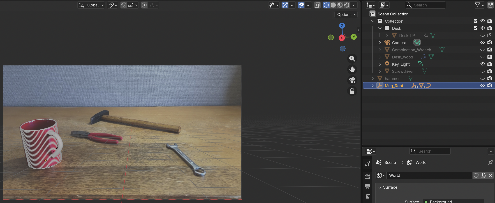

### 8.2.2 Setting the Annotation Image as the Background

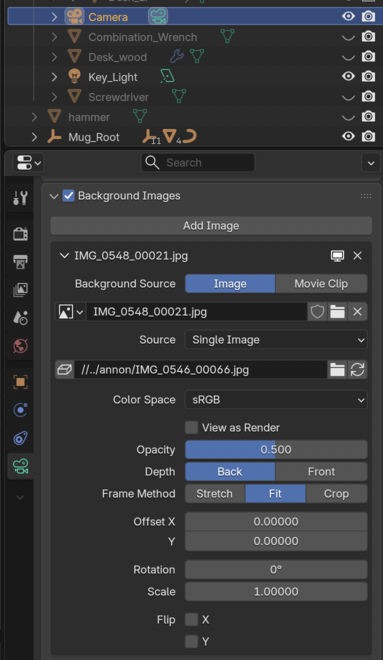

### 8.2.3 Overlaying the 3D Object on the Real Image

The 3D object is displayed in `Wireframe` mode, and its position and orientation are adjusted to match the object in the real image.

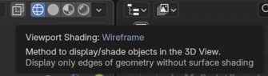

After alignment, the `.blend` file is saved and the following script is executed.

```bash
/Applications/Blender5_1_2.app/Contents/MacOS/Blender \
    -b tool_pose.blend -P save_source_gt.py
```

**Note**: This annotation process was performed on a **Mac**.


Output: `source_GT.jsonl`, which stores the target object's 3D/2D information for the real images.

## 8.3 Training Data Generation

### 8.3.1 3D / 2D Keypoint Projection

Script: `posegt_project_source.py` 
Input: `posegt_source_GT.jsonl`
Output: `posegt_projected_GT.jsonl`
```bash
blender$ blender5 -b tool_pose.blend -P posegt_project_source.py
```

### 8.3.2 Real Dataset Generation

Script: `posegt_datagen_real.py`
```python
DEFAULT_SOURCE_GT = Path(
    "../blender/posegt_projected_GT.jsonl"
)
DEFAULT_OUTPUT_DIR = Path(
    "dataset/real_posegt"
)

REAL_IMAGE_DIR = Path(
    "dataset/real_anno"
)
```

Training data is generated using `DEFAULT_SOURCE_GT` and `REAL_IMAGE_DIR` as inputs:
```bash
(.venv) keypoint$ python training/posegt_datagen_real.py
```

### 8.3.3 Fine-tuning

Training script: `train_real_fit.py`
```python
DATASET_ROOT = (
    # "dataset/real"
    "dataset/real_posegt"
)

BASE_MODEL = Path(
    "model/sim/best_model.pth"
)

OUTPUT_DIR = Path(
    # "model/real"
    "model/real_posegt"
)
```

```bash
(.venv) keypoint$ python training/train_real_fit.py 
```

### 8.3.4 Inference

Inference script: `run_pipeline_real.py`
```python
DEFAULT_KEYPOINT_MODEL_PATH = Path(
    # "model/sim/best_model.pth"
    # "model/real/best_model.pth"
    "model/real_posegt/best_model.pth"
)

DEFAULT_OUTPUT_DIR = Path(
    # "output/pipeline_keypoint_real_simonly"
    "output/pipeline_keypoint_posegt"
)
```
```bash
(.venv) keypoint$ python training/run_pipeline_real.py 
```

## 8.4 Results

For this experiment, **59** images from the following scenes used in the inference-result video were re-annotated:
```
    "IMG_0540",
    "IMG_0541",
    "IMG_0543",
    "IMG_0546",
    "IMG_0548",
    "IMG_0549",
    "IMG_0550",
    "IMG_0552",
```

After improving the annotations, the large flips and abrupt changes in the estimated coordinate frame observed before the improvement were reduced, producing more consistent pose-estimation results across frames. Because quantitative Pose GT is not available, temporal stability is evaluated here primarily from the visualization results.

[Watch the Before/After video on YouTube](https://youtu.be/rC1AJGKOdmE)
